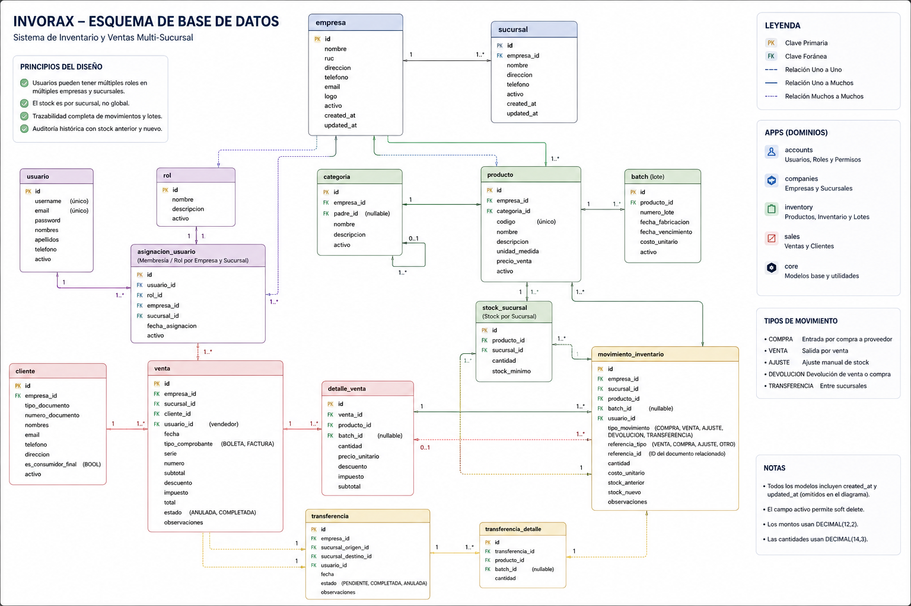

# Invorax

## Problema
Muchas pequeñas empresas gestionan su inventario y sus ventas de forma desorganizada, lo que provoca perdidas de tiempo, perdidas de productos, errores en el stock y dificultades para conocer el estado del negocio

## Solucion
Invorax permite gestionar el inventario y las ventas de forma ordenada, rápida y accesible desde cualquier dispositivo con conexión a internet.


# Estructura del Proyecto Actual (version 1)
```bash
├── backend
│   ├── accounts
│   │   ├── admin.py
│   │   ├── apps.py
│   │   ├── __init__.py
│   │   ├── migrations
│   │   │   └── __init__.py
│   │   ├── models.py
│   │   ├── tests.py
│   │   └── views.py
│   ├── companies
│   │   ├── admin.py
│   │   ├── apps.py
│   │   ├── __init__.py
│   │   ├── migrations
│   │   │   └── __init__.py
│   │   ├── models.py
│   │   ├── tests.py
│   │   └── views.py
│   ├── core
│   │   ├── admin.py
│   │   ├── apps.py
│   │   ├── __init__.py
│   │   ├── migrations
│   │   │   └── __init__.py
│   │   ├── models.py
│   │   ├── tests.py
│   │   └── views.py
│   ├── inventory
│   │   ├── admin.py
│   │   ├── apps.py
│   │   ├── __init__.py
│   │   ├── migrations
│   │   │   └── __init__.py
│   │   ├── models.py
│   │   ├── tests.py
│   │   └── views.py
│   ├── invorax
│   │   ├── asgi.py
│   │   ├── __init__.py
│   │   ├── __pycache__
│   │   │   ├── __init__.cpython-312.pyc
│   │   │   └── settings.cpython-312.pyc
│   │   ├── settings.py
│   │   ├── urls.py
│   │   └── wsgi.py
│   ├── manage.py
│   ├── sales
│   │   ├── admin.py
│   │   ├── apps.py
│   │   ├── __init__.py
│   │   ├── migrations
│   │   │   └── __init__.py
│   │   ├── models.py
│   │   ├── tests.py
│   │   └── views.py
│   └── schema.png
└── README.md
```

### Utilizando la imagen de referencia para la arquitectura de los datos

